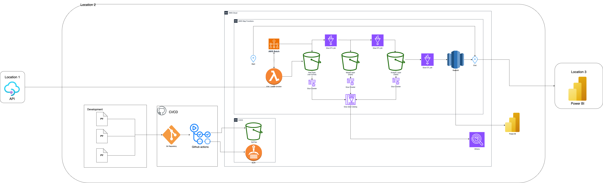
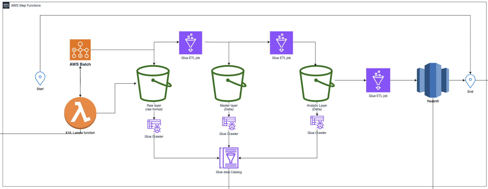
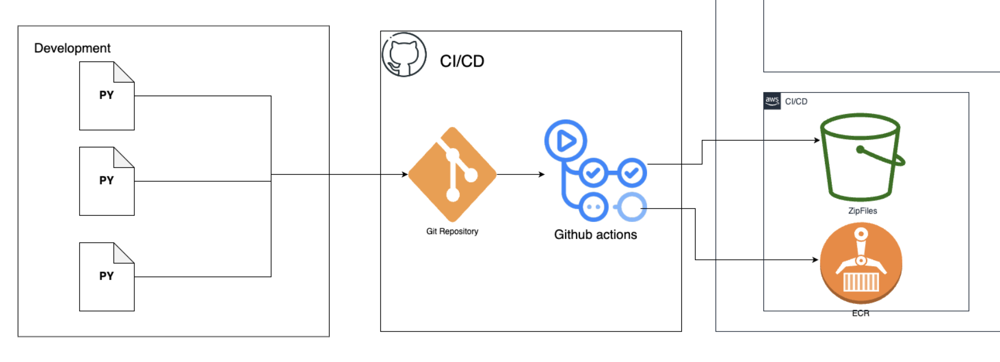
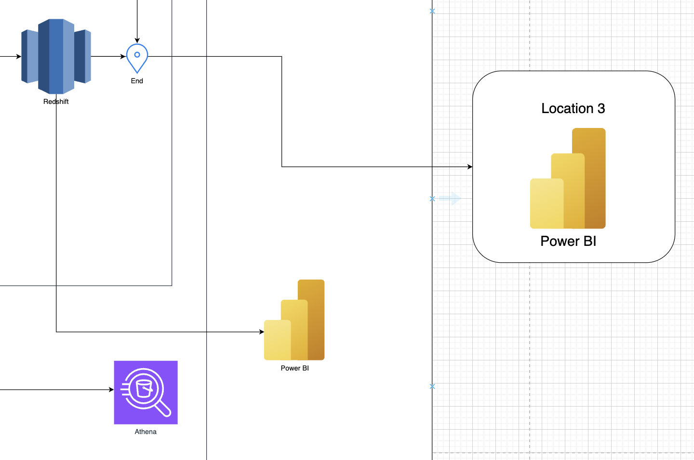
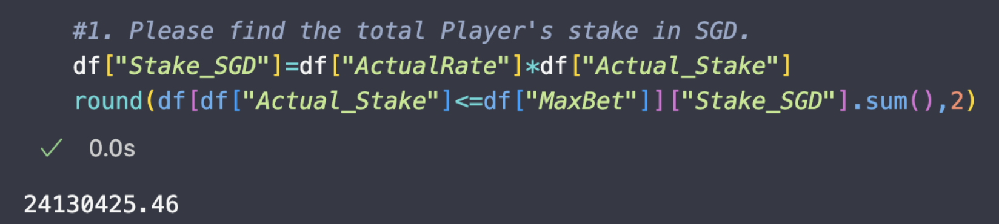
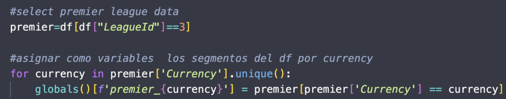
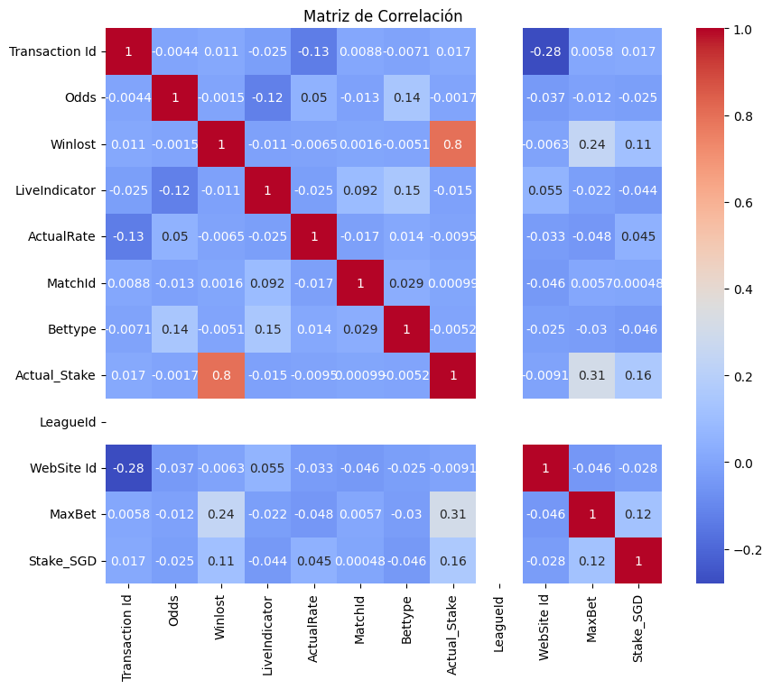
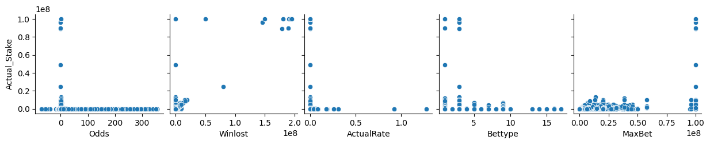
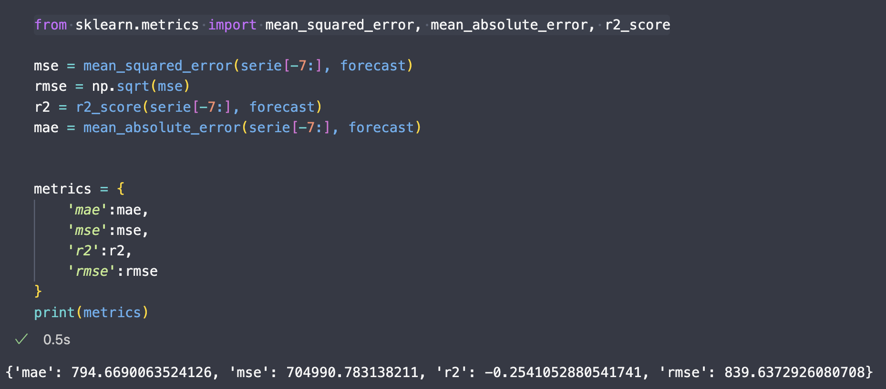

# Proceso Data Engineer – 1° Masami Nakada – Etapa 2 Resuelta

Para mayor detalle del desarrollo del caso 1 y caso 2 verificar el repositorio en Github :   
https://github.com/MasamioNakada/sample_arquitecture

## Caso 1

### **Arquitectura General**

### Detalle ETL

### Detalle CI/CD

### 

### Detalle Location 3

#### **Suposiciones:**

#### Extracción de datos:

- **AWS Lambda**: Se utilizará para la extracción de las 16 tablas con menos de 1000 registros diarios, debido a su bajo costo y capacidad de ejecución rápida de tareas ligeras.  
- **AWS Batch:** Se usará para la tabla transaccional, ya que maneja entre 800,000 y 1 millón de registros diarios, lo que requiere un procesamiento más intensivo en tiempo .AWS Batch nos permite ejecutar en instancias de EC2 cargas de trabajo que demanden de tiempo.

#### Procesamiento de datos:

- **AWS Glue ETL Jobs**: Se empleará para el procesamiento ETL/ELT, utilizando Apache Spark, ideal para el manejo de grandes volúmenes de datos.

#### Almacenamiento de datos:

- **S3 como Delta Lake**: Este almacenamiento permitirá el manejo eficiente de versiones de datos y transacciones ACID con los archivos Delta. S3 nos permite  replicar los datos como también asegura la durabilidad de los datos almacenados .

#### Análisis , Visualización, Reporting:

- **AWS Glue Data Catalog y Amazon Athena:** para un fácil análisis ( query)  de los datos almacenados en todas las capas.   
- **Amazon Redshift**: para optimizar la disponibilidad e integración de los data Mart para Power bi , o plataformas web  
- Power Bi : Visualización de  datos 

#### Automatización:

- **AWS Step Functions**: Orquestarán el flujo de trabajo, automatizando el pipeline ETL/ELT que se ejecutará durante la madrugada todos los días.

Se propuso una capa de ci/cd para desarrollar y testear en local y después subirlo directamente a la infraestructura mediante workflows de GitHub action como imágenes para AWS Batch , zip files para los Lambda o spark jobs a AWS Glue ETL job.

### Preguntas:

* **¿Qué tipo de archivo utilizaría en el proceso de Pipeline de Datos? ¿Porqué?**  
  Utilizaría archivos Delta debido a su optimización para consultas, capacidad de control de versiones y soporte para transacciones ACID, lo cual facilita los procesos de analítica y transformación.

* **¿Utilizaría Base de Datos?**  
  Sí, utilizaría una base de datos NoSQL, específicamente una base de datos columnar como Amazon Redshift. Esto mejora la disponibilidad de los datos para el uso en dashboards y facilita la integración con otros sistemas y equipos.  
    
* **¿Qué herramienta de dashboard sugeriría al equipo de Analítica?, ¿Porqué?**  
  Recomendaría Power BI por su capacidad para dinamizar el desarrollo de dashboards, su facilidad para compartir informes en diferentes áreas del negocio y su amplia aceptación en el mercado latinoamericano.

## Case 2

1\. Please find the total Player's stake in SGD.  

2\. From your observations of the data provided, please share 5 or more insights that you may have.

* Detección de Amaños:  
1. Identificación de Ligas No Comunes  
2.  Análisis de Bettypes y Betteams No Comunes

   Al combinar ambos análisis podríamos detectar concentraciones de apuestas no comunes y así evitar pérdidas significativas antes que se resuelva la apuesta

   

* Identificar las ligas donde hay más apuestas tipo Live para incentivar a los usuarios de esas ligas a apostar antes de que empiece el evento y maximizar las ganancias.  
* Identificar los tipos de apuestas y las ligas en las transacciones en las que las apuestas resultan favorables para el usuario. Utilizar técnicas de web scraping para comparar las cuotas (odds) con las ofrecidas por otras casas de apuestas y verificar si estamos proporcionando cuotas más altas. Según los hallazgos, ajustar las cuotas, ya sea aumentándolas o disminuyéndolas, en función de los objetivos del área de negocio.  
* Utilizando el `WebSite Id`, podemos generar una tabla resumen que incluya el total del monto apostado, el total del monto ganado y un indicador de si el usuario está en pérdida o ganancia, todo con un enfoque de tiempo de vida (lifetime). Esto nos permite medir la proporción de usuarios que están generando rentabilidad para el negocio y monitorear los cambios a lo largo del tiempo, convirtiéndose en una métrica clave para evaluar la salud de cómo se están gestionando las apuestas dentro del negocio.  
* Hacer una tabla resumen por mes / dia /hora para ver la temporalidad de las transacciones con el objetivo de identificar y explicar  los patrones de la información

  
3\. Prediga la apuesta real de la Premier League inglesa de cada moneda para la semana siguiente a partir de este conjunto de datos. Por favor, proporcione sus suposiciones y explicaciones.

#### 

- #### Check correlation (General)

  
- Plots the correlation between the variables and the target variable 'Actual\_Stake' 

 
*\#ML*  
from statsmodels.tsa.arima.model import ARIMA  
from statsmodels.tsa.stattools import adfuller, pacf, acf

df\=premier\_CNY

*\# Convertir Transaction Date a datetime*  
df\[*'Transaction Date'*\] \= pd.to\_datetime(df\[*'Transaction Date'*\])

*\# Establecer Transaction Date como índice*  
df.set\_index(*'Transaction Date'*, *inplace*\=True)

*\# Reordenar índice de fecha*  
df.sort\_index(*inplace*\=True)

*\# Eliminar fechas duplicadas y NaN*  
df.drop\_duplicates(*inplace*\=True)  
df.dropna(*inplace*\=True)

*\# Establecer frecuencia del índice de fecha*  
df.index \= pd.date\_range(*start*\=df.index.min(), *periods*\=len(df), *freq*\=*'D'*)

*\# Crear serie temporal con Actual\_Stake*  
serie \= df\[*'Actual\_Stake'*\]

*\# Diferenciar serie temporal*  
serie\_diff \= serie.diff().dropna()

*\# Identificar orden de integración (d)*  
result \= adfuller(serie\_diff)  
d \= 1  *\# Orden de integración (d)*

*\# Identificar orden de autoregresión (p) y movilidad (q)*  
pacf\_values \= pacf(serie\_diff, *nlags*\=10)  
acf\_values \= acf(serie\_diff, *nlags*\=10)  
p \= 1  *\# Orden de autoregresión (p)*  
q \= 1  *\# Orden de movilidad (q)*

*\# Crear modelo ARIMA*  
model \= ARIMA(serie, *order*\=(p,d,q))

*\# Ajustar modelo*  
model\_fit \= model.fit()

*\# Predecir valores para la próxima semana*  
forecast \= model\_fit.forecast(*steps*\=7)

*\# Imprimir resultados*  
print(*'Coeficientes:'*, model\_fit.params)  
print(*'Predicciones:'*, forecast)  
print(model\_fit.summary())

**Result:**  
Coeficientes: ar.L1            0.0601  
ma.L1           \-1.0000  
sigma2   4,615,008.0758  
dtype: float64  
Predicciones: 2025-01-29 04:30:24.263   732.2555  
2025-01-30 04:30:24.263   775.9707  
2025-01-31 04:30:24.263   778.5984  
2025-02-01 04:30:24.263   778.7564  
2025-02-02 04:30:24.263   778.7659  
2025-02-03 04:30:24.263   778.7665  
2025-02-04 04:30:24.263   778.7665  
Freq: D, Name: predicted\_mean, dtype: float64  
                               SARIMAX Results                                  
\==============================================================================  
Dep. Variable:           Actual\_Stake   No. Observations:                  716  
Model:                 ARIMA(1, 1, 1\)   Log Likelihood               \-6503.245  
Date:                Fri, 30 Aug 2024   AIC                          13012.490  
Time:                        10:49:57   BIC                          13026.207  
Sample:                    02-13-2023   HQIC                         13017.787  
                         \- 01-28-2025                                           
Covariance Type:                  opg                                           
\==============================================================================  
                 coef    std err          z      P\>|z|      \[0.025      0.975\]  
\------------------------------------------------------------------------------  
ar.L1          0.0601      0.032      1.901      0.057      \-0.002       0.122  
ma.L1         \-1.0000      0.011    \-94.285      0.000      \-1.021      \-0.979  
sigma2      4.615e+06    2.3e-09   2.01e+15      0.000    4.62e+06    4.62e+06  
\===================================================================================  
Ljung-Box (L1) (Q):                   0.00   Jarque-Bera (JB):             70233.03  
Prob(Q):                              0.95   Prob(JB):                         0.00  
Heteroskedasticity (H):               0.83   Skew:                             6.24  
Prob(H) (two-sided):                  0.14   Kurtosis:                        49.92  
\===================================================================================

Warnings:  
\[1\] Covariance matrix calculated using the outer product of gradients (complex-step).  
\[2\] Covariance matrix is singular or near-singular, with condition number 2.13e+30. Standard errors may be unstable.

4\. Give at least one suggestion on which metric within the data set to focus on in order to improve the Player's Actual Stake amount based on this data set. Please provide your assumptions and explanations.

Para mejorar el monto de la apuesta real, se propone utilizar la mediana de las apuestas de un evento (`MA` \- median amount) y compararla con el monto de la apuesta actual del jugador (`Actual_Stake`). La métrica se puede calcular de la siguiente manera: 

$metric=\frac{MA}{Actual Stake} * 100$

Si esta métrica es inferior al 100%, se puede interpretar que la apuesta de la transacción es menor a lo que normalmente se apuesta en ese evento. Esta idea también se podría aplicar a los montos acumulados de por vida de cada cliente, generando otras métricas que indiquen el nivel de riesgo que toma el usuario al apostar.

Identificando a los usuarios que toman menos riesgos, dependiendo del objetivo del negocio, se podrían implementar estrategias como ofrecer más bonos, ajustar las cuotas, entre otras, para incentivar a estos usuarios a aumentar sus apuestas o cambiar su comportamiento de apuestas. Esto permitiría adaptar las ofertas y promociones a diferentes segmentos de clientes, optimizando la rentabilidad y la retención.
